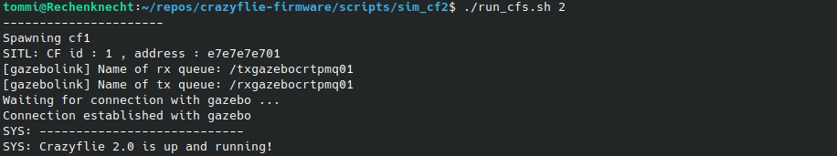

# ROS2 Gazebo Simulation for the Crazyflie

This project is based on the Gazebo Simulation for Crazyflie CRTP *sim_cf* from https://github.com/wuwushrek/sim_cf

It features

* Full software-in-the-loop (SITL) Crazyflie firmware implementation utilizing the FreeRTOS Linux Port https://www.freertos.org/FreeRTOS-simulator-for-Linux.html#SimulatorApp
* Compatibility with the Crazyflie python library (cflib)
* Integration of the Crazyflie firmware for SITL build process into KBuild
* Build for ROS2 and Gazebo 11

In contrast to the original *sim_cf*, hardware-in-the-loop (HITL) is not supported.

Beside this ROS2 package you will need

* Crazyflie firmware with modifications for SITL https://github.com/CrazyflieTHI/crazyflie-firmware
* Crazyflie python library with additional *simlink* driver https://github.com/CrazyflieTHI/crazyflie-lib-python

## Installation - Ubuntu 22.04 with ROS2 Humble and Gazebo 11

Tested on an Ubuntu 22.04 LTS machine

### Dependencies

Basic dependencies

```sh
sudo apt-get install cmake build-essential genromfs ninja-build
```

Protobuf, eigen3 and google-glog dependencies

```sh
sudo apt-get install protobuf-compiler libgoogle-glog-dev libeigen3-dev libxml2-utils
```

Cyclone DDS
```sh
sudo apt install ros-humble-rmw-cyclonedds-cpp
```

Xacro library
```sh
sudo apt install ros-humble-xacro
```

### Additional ROS2 Packages

Clone ROS2 version of *mav_comm* into your colcon overlay (assuming ~/dev_ws)

```sh
cd ~/dev_ws/src
```

```sh
git clone https://github.com/CrazyflieTHI/mav_comm.git
```

### Build the Packages

Move into your colcon overlay (assuming ~/dev_ws) and use colcon build

```sh
cd ~/dev_ws
```

```sh
colcon build
```

## Setting Up the Simulation

Running the simulation requires

* *sim_cf* package built
* Crazyflie firmware compiled for SITL
* Crazyflie python library installed containing the *simlink* driver (on simlink branch)

### Add Path to Crazyflie Firmware Executable

Open the *run_cfs.sh* script located in *sim_cf2/scripts* and add the path to the *cf2.elf* in your crazyflie-firmware repository


### Adjust the Launch Script

The number of simulated Crazyflies is determined by the main launch file *main.launch.xml* in the *sim_cf2/launch* folder. By default, two Crazyflies are simulated and code for the instantiation of four further Crazyflies is present but commented out. Adjust the launch file to your needs by adding or removing Crazyflies. Initial pose and rotor color is set in the *main.launch.xml* file.

## Run the Simulation

### 1. Start Gazebo

Open a terminal and source the ROS2 workspace if not done already (assuming the overlay or workspace in ~/dev_ws)

```sh
source ~/dev_ws/install/local_setup.bash
```

Use the ROS2 launch command to start the *sim_cf2* simulation

```sh
ros2 launch sim_cf2 main.launch.xml
```

Gazebo will start in paused mode and trying to establish a connection to the software-in-the-loop Crazyflie firmware instances.


### 2. Run Crazyflie Firmware SITL Instances

Open a new terminal and move to the scripts folder of the *2sim_cf2* repository (assuming ~/dev_ws/src/sim_cf2)

```sh
cd ~/dev_ws/src/sim_cf2/scripts
```

Run the *run_cfs.sh* script with as many instances of simulated Crazyflies as needed by providing the amount of Crazyflies as argument (two by default)
```sh
./run_cfs.sh 2
```

The SITL instances will establish a connection to Gazebo



**Press PLAY in Gazebo**

### 3. Run a Python Script

Start your *cflib*-based python script with activated *simlink* driver. Example scripts can be found in the Crazyflie python library with additional *simlink* driver https://github.com/CrazyflieTHI/crazyflie-lib-python/tree/master/examples/sim_cf2

Run for example the autonomousSequence.py script

```sh
python autonomousSequence.py
```


### 4. Exit Gazebo and SITL

Press Ctrl+C in the terminals running Gazebo and the SITL instances

Processes should get killed and POSIX message queues should get deleted. If POSIX message queues are not deleted due to errors, they eventually may cause issues when starting the simulation again. The queues are located in */dev/mqueue*

If problems occur, delete the queues manually

Show queues
```sh
ls /dev/mqueue
```

Delete the queues
```sh
sudo rm /dev/mqueue/<sim_cf2_queues>
```
